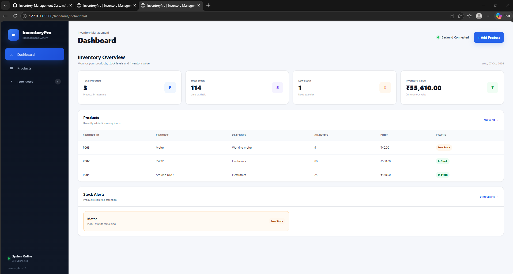
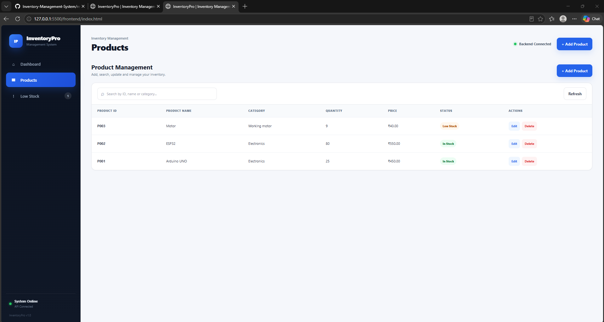
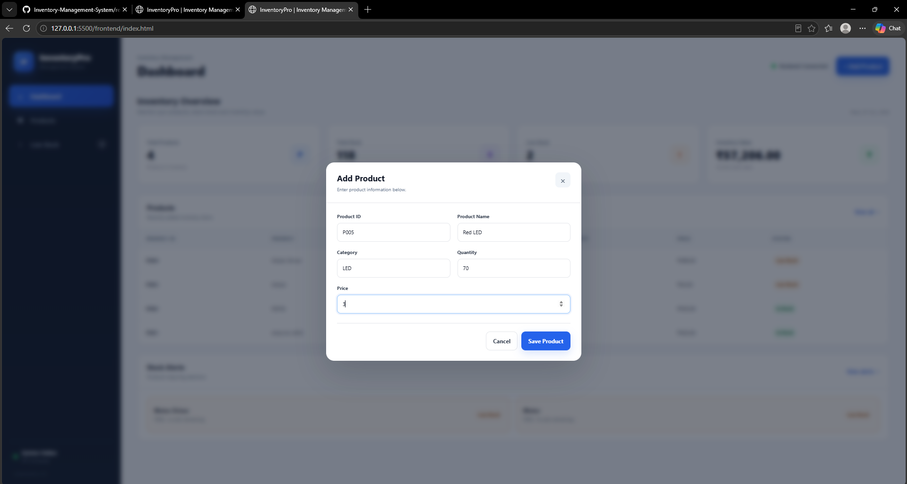
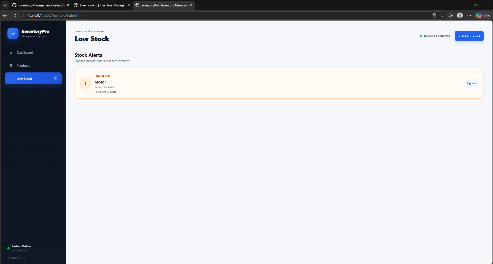
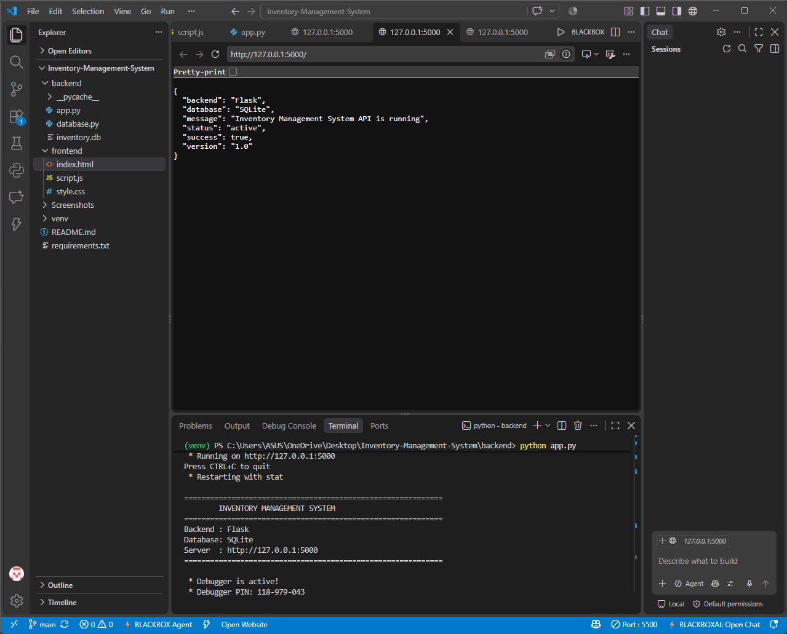
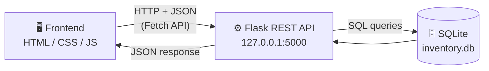

<div align="center">

# 📦 InventoryPro

### Inventory / Product Management System

A clean, web-based dashboard to manage products, track stock levels, and get **low-stock alerts** in real time.


</div>

---

## 📑 Table of Contents

- [Overview](#-overview)
- [Features](#-features)
- [Screenshots](#-screenshots)
- [Tech Stack](#-tech-stack)
- [System Architecture](#-system-architecture)
- [Project Structure](#-project-structure)
- [Getting Started](#-getting-started)
- [API Documentation](#-api-documentation)
- [Validation Rules](#-validation-rules)
- [Sample Data](#-sample-data)
- [Future Scope](#-future-scope)
- [Author](#-author)

---

## 🎯 Overview

**InventoryPro** is a mini project that lets a small business or lab manage its inventory from a single, easy-to-use dashboard. Users can add, view, search, update, and delete products, while the system automatically highlights items that are running low on stock.

The frontend talks to a **Flask REST API** using **JSON**, and all data is stored in an **SQLite** database. Search works **without page reload**.

---

## ✨ Features

| 📊 Dashboard | 🛒 Product Management | ⚠️ Low Stock Monitoring |
|---|---|---|
| Total products | Add new products | Auto-detects low-stock items |
| Total available stock | View all products | Shows remaining quantity |
| Low-stock count | Live search (no reload) | Dedicated Low Stock page |
| Total inventory value | Edit product details | Quick **Update** button |
| Recently added products | Update stock and price | Stock alerts on dashboard |
| Stock alerts panel | Delete products | |

**Also included**

- 🔌 Backend connection status indicator
- ✅ Input validation (no negative quantity or price)
- 🌐 REST API using `GET`, `POST`, `PUT`, `DELETE`
- 🧾 JSON-based communication
- 🧭 Sidebar navigation with a modern, responsive layout

---

## 📸 Screenshots

### Dashboard


### Products


### Add Product


### Low Stock


### Backend Running (Flask in VS Code)


---

## 🛠️ Tech Stack

| Layer | Technology |
|---|---|
| **Frontend** | HTML5, CSS3, JavaScript (Fetch API) |
| **Backend** | Python, Flask, Flask-CORS |
| **Database** | SQLite |
| **API Style** | REST, JSON |
| **Tools** | VS Code, Git, GitHub, Live Server |

---

## 🏗️ System Architecture



**Flow:** the browser sends a request → Flask validates it → SQLite is read or updated → Flask returns JSON → the UI refreshes instantly.

---

## 📁 Project Structure

```text
Inventory-Management-System/
│
├── backend/
│   └── app.py              # Flask REST API + SQLite logic
│
├── frontend/
│   ├── index.html          # Dashboard layout
│   ├── style.css           # Styling
│   └── script.js           # UI logic + API calls
│
├── screenshots/
│   ├── dashboard.png
│   ├── products.png
│   ├── add-product.png
│   ├── low-stock.png
│   └── vscode-backend.png
│
├── README.md
├── requirements.txt
└── .gitignore
```

> The SQLite database file (`inventory.db`) is created automatically when the backend runs for the first time.

---

## 🚀 Getting Started

### Prerequisites

- Python 3.10 or higher
- Git
- VS Code with the **Live Server** extension (or any static file server)

### Installation

**1. Clone the repository**

```bash
git clone https://github.com/atul-nandanwar/Inventory-Management-System.git
cd Inventory-Management-System
```

**2. (Optional) Create a virtual environment**

```bash
python -m venv venv
# Windows (Git Bash)
source venv/Scripts/activate
# Windows (CMD / PowerShell)
venv\Scripts\activate
```

**3. Install dependencies**

```bash
pip install -r requirements.txt
```

**4. Start the backend**

```bash
python backend/app.py
```

Backend runs at 👉 `http://127.0.0.1:5000`

**5. Start the frontend**

Open `frontend/index.html` in VS Code, right-click → **Open with Live Server**.

Frontend runs at 👉 `http://127.0.0.1:5500/frontend/index.html`

> ✅ When both are running, the dashboard shows **Backend Connected**.

---

## 🔌 API Documentation

**Base URL:** `http://127.0.0.1:5000/api/products`

| Method | Endpoint | Description |
|:---:|---|---|
| `GET` | `/api/products` | Get all products |
| `POST` | `/api/products` | Add a new product |
| `PUT` | `/api/products/<product_id>` | Update an existing product |
| `DELETE` | `/api/products/<product_id>` | Delete a product |

### Example: Add a product

**Request**

```http
POST /api/products
Content-Type: application/json
```

```json
{
  "product_id": "P004",
  "name": "Raspberry Pi 4",
  "category": "Electronics",
  "quantity": 12,
  "price": 4500
}
```

**Response**

```json
{
  "message": "Product added successfully"
}
```

### Example: Quick test with curl

```bash
curl http://127.0.0.1:5000/api/products
```

---

## 🛡️ Validation Rules

| Field | Rule |
|---|---|
| Quantity | Must not be negative |
| Price | Must not be negative |
| Required fields | Must be filled before submission |

Invalid input is rejected and the user is shown an error message.

---

## 🧪 Sample Data

| ID | Product | Category | Quantity | Price |
|:---:|---|---|:---:|---:|
| P001 | Arduino UNO | Electronics | 25 | ₹450 |
| P002 | ESP32 | Electronics | 8 | ₹550 |
| P003 | Ultrasonic Sensor | Sensors | 5 | ₹250 |

ESP32 and Ultrasonic Sensor appear on the **Low Stock** page.

---

## 🔮 Future Scope

- 🔐 User login and role-based access
- 📤 Export inventory to CSV / PDF
- 📈 Charts for stock trends
- 📧 Email alerts for low stock
- 📷 Barcode / QR scanning

---

## 👤 Author

**Atul Nandanwar**
B.Tech, Electronics & Communication Engineering

[](https://github.com/atul-nandanwar)

---

<div align="center">

⭐ Developed as a Mini Project for Teacher Assessment ⭐

</div>
